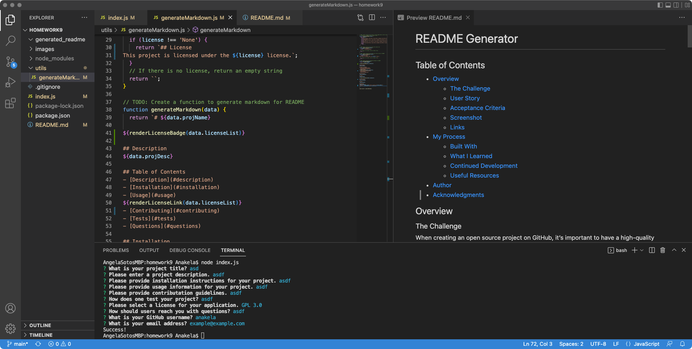
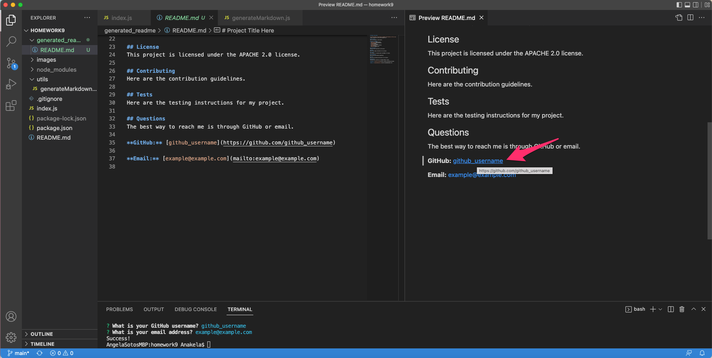
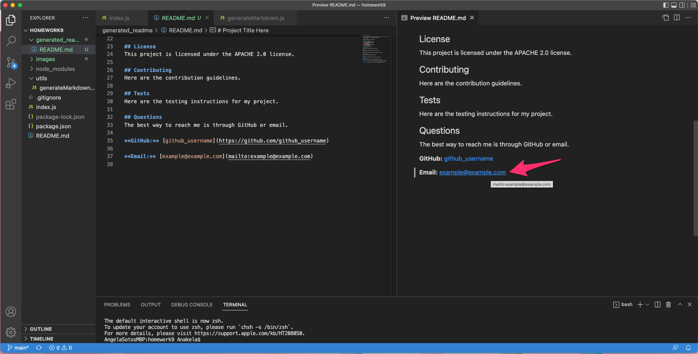

# Challenge 9: README Generator

## Table of Contents

- [Overview](#overview)
  - [The Challenge](#the-challenge)
  - [User Story](#user-story)
  - [Acceptance Criteria](#acceptance-criteria)+
  - [How This Works Video](#how-this-works-video)
  - [Screenshot](#screenshot)
  - [Links](#links)
- [My Process](#my-process)
  - [Built With](#built-with)
  - [What I Learned](#what-i-learned)
  - [Continued Development](#continued-development)
  - [Useful Resources](#useful-resources)
- [Author](#author)
- [Acknowledgments](#acknowledgments)

## Overview

### The Challenge

When creating an open source project on GitHub, it’s important to have a high-quality README for the app. This should include what the app is for, how to use the app, how to install it, how to report issues, and how to make contributions—this last part increases the likelihood that other developers will contribute to the success of the project.

You can quickly and easily generate a README file by using a command-line application to generate one. This allows the project creator to devote more time working on the project.

Your task is to create a command-line application that dynamically generates a professional README.md file from a user's input using the Inquirer package (Links to an external site.). Review the Professional README Guide (Links to an external site.) as a reminder of everything that a high-quality, professional README should contain.

The application will be invoked by using the following command:

`node index.js`

Because this application won’t be deployed, you’ll also need to provide a link to a walkthrough video that demonstrates its functionality. Revisit 2.2.4: Screencastify Tutorial in Module 2 of the prework as a refresher on how to record video from your computer. You’ll need to submit a link to the video and add it to the README of your project.

**IMPORTANT**
> Make sure to clone the starter code repository and make your own repository with the starter code. Do not fork the starter code repository!

Before you start, clone the [starter code](https://github.com/coding-boot-camp/potential-enigma).

### User Story

```
AS A developer
I WANT a README generator
SO THAT I can quickly create a professional README for a new project
```

### Acceptance Criteria

```
GIVEN a command-line application that accepts user input
WHEN I am prompted for information about my application repository
THEN a high-quality, professional README.md is generated with the title of my project and sections entitled Description, Table of Contents, Installation, Usage, License, Contributing, Tests, and Questions
WHEN I enter my project title
THEN this is displayed as the title of the README
WHEN I enter a description, installation instructions, usage information, contribution guidelines, and test instructions
THEN this information is added to the sections of the README entitled Description, Installation, Usage, Contributing, and Tests
WHEN I choose a license for my application from a list of options
THEN a badge for that license is added near the top of the README and a notice is added to the section of the README entitled License that explains which license the application is covered under
WHEN I enter my GitHub username
THEN this is added to the section of the README entitled Questions, with a link to my GitHub profile
WHEN I enter my email address
THEN this is added to the section of the README entitled Questions, with instructions on how to reach me with additional questions
WHEN I click on the links in the Table of Contents
THEN I am taken to the corresponding section of the README
```

### [How This Works Video](./videos/soto-challenge9-readme-recording.mp4)

### Screenshot





### Links

- Solution URL: [https://github.com/anakela/professional-readme-generator](https://github.com/anakela/professional-readme-generator)

## My Process

### Built With

- Node.js
- JavaScript

### What I Learned

This challenge was difficult for me.  Upon viewing the starter code, I was completely lost.  However, with some guidance, I was able to figure out how to navigate this assignment.  For instance, after creating my `questions` array, I initially attempted to complete the `writeToFile` function.  Howver, I was advised by one of my TAs to complete this portion last.  That assistance was taken and greatly appreciated!

One of the first things I had the opportunity to experience in this challenge was using `require` to link the `Node.js` functionality for `Inquirer`, `file system`, and this project's `generateMarkdown.js` file.

```JavaScript
const inquirer = require('Inquirer');
const fs = require('fs');
const generateMarkdown = require('./utils/generateMarkdown');
```

I also liked being able to use `Node.js switch` statements to provide users with choices.

```JavaScript
function renderLicenseBadge(license) {
  switch (license) {
    case 'MIT': 
      return `[](https://opensource.org/licenses/MIT)`;
    case 'APACHE 2.0':
      return `[](https://opensource.org/licenses/Apache-2.0)`;
    case 'GPL 3.0':
      return `[](https://www.gnu.org/licenses/gpl-3.0)`;
    case 'BSD 3':
      return `[](https://opensource.org/licenses/BSD-3-Clause)`;
    default:
      return '';
  }
}
```

Thirdly, I enjoyed being able to create README.md elements using `Node.js` and `JavaScript`.

```JavaScript
function renderLicenseSection(license) {
  if (license !== 'None') {
    return `## License  
${renderLicenseBadge(license)}

This project is licensed under the ${renderLicenseLink(license)}.`;
  }
  return ``;
}
```

Lastly, I learned that in order to format the generated `README.md` file correctly, I needed to remove any indentation that was automated by my code editor.  This helped create a more professional README.md file!

### Continued Development

I would like to update this application to write multiple README.md files instead of overwriting the single README.md file.  To do this, I would add an additional question to my `questions` array of objects asking the user to specify a name for their README file.  I would then use this name as the title for the README.md file.

```JavaScript
const questions = [
    {
        message: 'What would you like your README file to be named?',
        name: 'readMeName',
        type: 'input',
        default: 'README'
    },
];
```

```JavaScript
function writeToFile(readMeName, markdown) {
    fs.writeFile(`generated-readme/${readMeName}.md`, markdown, err => {
        if (err) {
            console.log(err);
        } else {
            console.log('Success!');
        }
    });
};
```

```JavaScript
function init() {
    inquirer
        .prompt(questions)
        .then(answers => {
          const markdown = generateMarkdown(answers);
          writeToFile(answers.readMeName, markdown);
        });
};
```

### Useful Resources

- [GeeksforGeeks: Node.js fs.writeFile() Method](https://www.geeksforgeeks.org/node-js-fs-writefile-method/)
- [Markdown Cheat Sheet](https://www.markdownguide.org/cheat-sheet/)
- [Markdown License Badges](https://gist.github.com/lukas-h/2a5d00690736b4c3a7ba)
- [MDN Web Docs: switch](https://developer.mozilla.org/en-US/docs/Web/JavaScript/Reference/Statements/switch)
- [Non-Polynomial Mantissa: Inquirer.js](https://www.npmjs.com/package/inquirer#examples)
- [Request-Response: The Full-Stack Blog: Professional README Guide](https://coding-boot-camp.github.io/full-stack/github/professional-readme-guide)

## Author

- GitHub - [https://github.com/anakela](https://github.com/anakela)
- LinkedIn - [https://www.linkedin.com/in/anakela/](https://www.linkedin.com/in/anakela/)

## Acknowledgments

- Fellow Bootcampers:
    - Nolan Spence
    - Ivy Chang
    - Andrew White
- Luigi Campbell (TA)